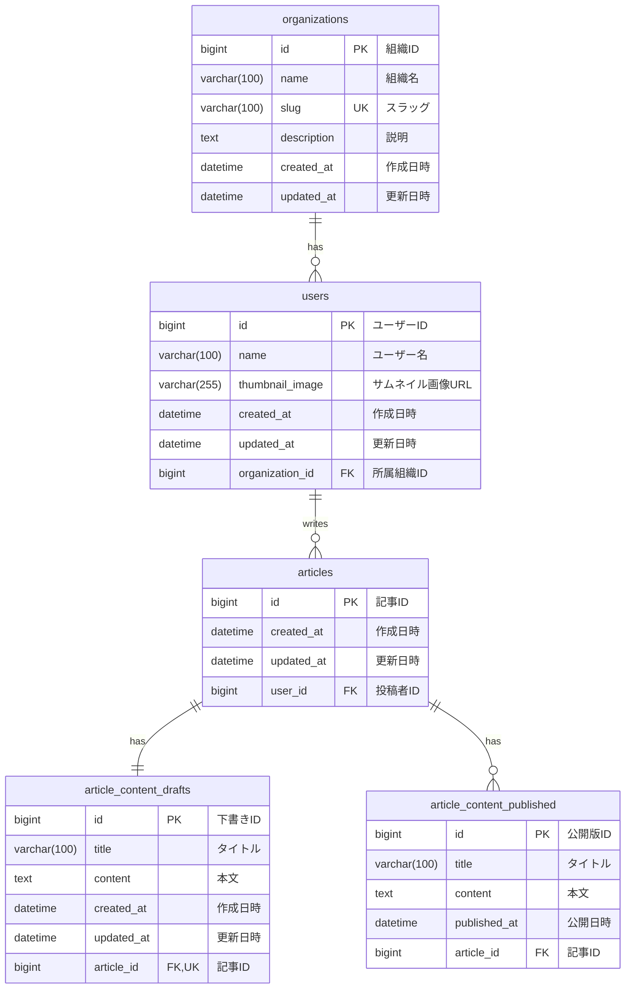

# データベース設計書

## ER図



## テーブル一覧

| テーブル名 | 説明 |
|-----------|------|
| organizations | 組織 |
| users | ユーザー |
| articles | 記事 |
| article_content_drafts | 記事コンテンツ（下書き） |
| article_content_published | 記事コンテンツ（公開版） |

## テーブル詳細
### organizations（組織）

| カラム名 | データ型 | NULL | キー | デフォルト | 説明 |
|---------|---------|------|------|-----------|------|
| id | bigint unsigned | NO | PK | AUTO_INCREMENT | 組織ID |
| name | varchar(100) | NO | | | 組織名 |
| slug | varchar(100) | NO | UK | | スラッグ（URL用識別子） |
| description | text | YES | | NULL | 説明 |
| created_at | datetime(6) | NO | | CURRENT_TIMESTAMP(6) | 作成日時 |
| updated_at | datetime(6) | NO | | CURRENT_TIMESTAMP(6) ON UPDATE | 更新日時 |

### users（ユーザー）

| カラム名 | データ型 | NULL | キー | デフォルト | 説明 |
|---------|---------|------|------|-----------|------|
| id | bigint unsigned | NO | PK | AUTO_INCREMENT | ユーザーID |
| name | varchar(100) | NO | | | ユーザー名 |
| thumbnail_image | varchar(255) | YES | | NULL | サムネイル画像URL |
| created_at | datetime(6) | NO | | CURRENT_TIMESTAMP(6) | 作成日時 |
| updated_at | datetime(6) | NO | | CURRENT_TIMESTAMP(6) ON UPDATE | 更新日時 |
| organization_id | bigint unsigned | YES | FK | NULL | 所属組織ID |

### articles（記事）

| カラム名 | データ型 | NULL | キー | デフォルト | 説明 |
|---------|---------|------|------|-----------|------|
| id | bigint unsigned | NO | PK | AUTO_INCREMENT | 記事ID |
| created_at | datetime(6) | NO | | CURRENT_TIMESTAMP(6) | 作成日時 |
| updated_at | datetime(6) | NO | | CURRENT_TIMESTAMP(6) ON UPDATE | 更新日時 |
| user_id | bigint unsigned | YES | FK | NULL | 投稿者ID |

### article_content_drafts（記事コンテンツ - 下書き）

| カラム名 | データ型 | NULL | キー | デフォルト | 説明 |
|---------|---------|------|------|-----------|------|
| id | bigint unsigned | NO | PK | AUTO_INCREMENT | 下書きID |
| title | varchar(100) | NO | | | タイトル |
| content | text | NO | | | 本文 |
| created_at | datetime(6) | NO | | CURRENT_TIMESTAMP(6) | 作成日時 |
| updated_at | datetime(6) | NO | | CURRENT_TIMESTAMP(6) ON UPDATE | 更新日時 |
| article_id | bigint unsigned | YES | FK, UK | NULL | 記事ID（1:1制約） |

### article_content_published（記事コンテンツ - 公開版）

| カラム名 | データ型 | NULL | キー | デフォルト | 説明 |
|---------|---------|------|------|-----------|------|
| id | bigint unsigned | NO | PK | AUTO_INCREMENT | 公開版ID |
| title | varchar(100) | NO | | | タイトル |
| content | text | NO | | | 本文 |
| published_at | datetime(6) | NO | | CURRENT_TIMESTAMP(6) | 公開日時 |
| article_id | bigint unsigned | YES | FK | NULL | 記事ID |

## DDL

```sql
-- 組織テーブル
CREATE TABLE `organizations` (
  `id` bigint unsigned NOT NULL AUTO_INCREMENT,
  `name` varchar(100) NOT NULL,
  `slug` varchar(100) NOT NULL,
  `description` text,
  `created_at` datetime(6) NOT NULL DEFAULT CURRENT_TIMESTAMP(6),
  `updated_at` datetime(6) NOT NULL DEFAULT CURRENT_TIMESTAMP(6) ON UPDATE CURRENT_TIMESTAMP(6),
  PRIMARY KEY (`id`),
  UNIQUE KEY `IDX_organizations_slug` (`slug`)
) ENGINE=InnoDB DEFAULT CHARSET=utf8mb4 COLLATE=utf8mb4_0900_ai_ci;

-- ユーザーテーブル
CREATE TABLE `users` (
  `id` bigint unsigned NOT NULL AUTO_INCREMENT,
  `name` varchar(100) NOT NULL,
  `thumbnail_image` varchar(255) DEFAULT NULL,
  `created_at` datetime(6) NOT NULL DEFAULT CURRENT_TIMESTAMP(6),
  `updated_at` datetime(6) NOT NULL DEFAULT CURRENT_TIMESTAMP(6) ON UPDATE CURRENT_TIMESTAMP(6),
  `organization_id` bigint unsigned DEFAULT NULL,
  PRIMARY KEY (`id`),
  KEY `FK_users_organization` (`organization_id`),
  CONSTRAINT `FK_users_organization` FOREIGN KEY (`organization_id`) REFERENCES `organizations` (`id`)
) ENGINE=InnoDB DEFAULT CHARSET=utf8mb4 COLLATE=utf8mb4_0900_ai_ci;

-- 記事テーブル
CREATE TABLE `articles` (
  `id` bigint unsigned NOT NULL AUTO_INCREMENT,
  `created_at` datetime(6) NOT NULL DEFAULT CURRENT_TIMESTAMP(6),
  `updated_at` datetime(6) NOT NULL DEFAULT CURRENT_TIMESTAMP(6) ON UPDATE CURRENT_TIMESTAMP(6),
  `user_id` bigint unsigned DEFAULT NULL,
  PRIMARY KEY (`id`),
  KEY `FK_articles_user` (`user_id`),
  CONSTRAINT `FK_articles_user` FOREIGN KEY (`user_id`) REFERENCES `users` (`id`)
) ENGINE=InnoDB DEFAULT CHARSET=utf8mb4 COLLATE=utf8mb4_0900_ai_ci;

-- 記事コンテンツ（下書き）テーブル
CREATE TABLE `article_content_drafts` (
  `id` bigint unsigned NOT NULL AUTO_INCREMENT,
  `title` varchar(100) NOT NULL,
  `content` text NOT NULL,
  `created_at` datetime(6) NOT NULL DEFAULT CURRENT_TIMESTAMP(6),
  `updated_at` datetime(6) NOT NULL DEFAULT CURRENT_TIMESTAMP(6) ON UPDATE CURRENT_TIMESTAMP(6),
  `article_id` bigint unsigned DEFAULT NULL,
  PRIMARY KEY (`id`),
  UNIQUE KEY `UQ_article_content_drafts_article` (`article_id`),
  CONSTRAINT `FK_article_content_drafts_article` FOREIGN KEY (`article_id`) REFERENCES `articles` (`id`)
) ENGINE=InnoDB DEFAULT CHARSET=utf8mb4 COLLATE=utf8mb4_0900_ai_ci;

-- 記事コンテンツ（公開版）テーブル
CREATE TABLE `article_content_published` (
  `id` bigint unsigned NOT NULL AUTO_INCREMENT,
  `title` varchar(100) NOT NULL,
  `content` text NOT NULL,
  `published_at` datetime(6) NOT NULL DEFAULT CURRENT_TIMESTAMP(6),
  `article_id` bigint unsigned DEFAULT NULL,
  PRIMARY KEY (`id`),
  KEY `FK_article_content_published_article` (`article_id`),
  CONSTRAINT `FK_article_content_published_article` FOREIGN KEY (`article_id`) REFERENCES `articles` (`id`)
) ENGINE=InnoDB DEFAULT CHARSET=utf8mb4 COLLATE=utf8mb4_0900_ai_ci;
```

## index 一覧

| テーブル | インデックス名 | カラム | 種類 |
|---------|---------------|--------|------|
| organizations | PRIMARY | id | PRIMARY |
| organizations | IDX_organizations_slug | slug | UNIQUE |
| users | PRIMARY | id | PRIMARY |
| users | FK_users_organization | organization_id | INDEX |
| articles | PRIMARY | id | PRIMARY |
| articles | FK_articles_user | user_id | INDEX |
| article_content_drafts | PRIMARY | id | PRIMARY |
| article_content_drafts | UQ_article_content_drafts_article | article_id | UNIQUE |
| article_content_published | PRIMARY | id | PRIMARY |
| article_content_published | FK_article_content_published_article | article_id | INDEX |
